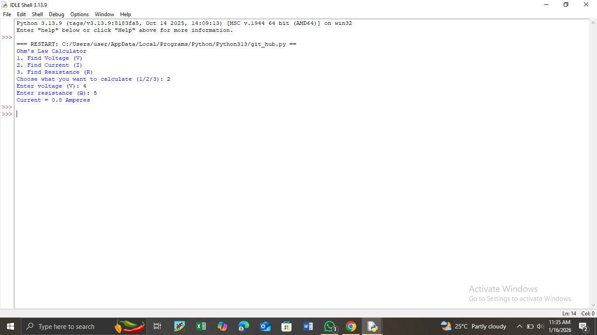

# Ohm’s Law Calculator

This project is a simple engineering-focused calculator based on Ohm’s Law, developed using Python.
It allows users to calculate Voltage (V), Current (I), or Resistance (R) when any two quantities are known.

##  Theory
Ohm’s Law states that:

V = I × R

where:
- V is voltage (volts)
- I is current (amperes)
- R is resistance (ohms)

##  Tools Used
- Python

##  How It Works
1. The user selects the quantity to calculate  
2. The program requests the required inputs  
3. The correct electrical value is computed and displayed

## Example Output

##  Purpose of the project
This project was developed to:
- Reinforce basic electrical engineering concepts
- Apply theoretical knowledge using programming
- Practice logical thinking and user input handling in Python

It represents an early step toward building skills in engineering-oriented software development

##  Future Improvements
- Add robust error handling for invalid inputs
- Implement a graphical user interface (GUI)
- Extend functionality to include power calculations
- Add unit selection (Ω, kΩ, mA, V)

##  Learning outcome 
- Practical application of ohm's law
- Improved understanding of user input and conditional logic
- Introduction to combining engineering theory with programming

